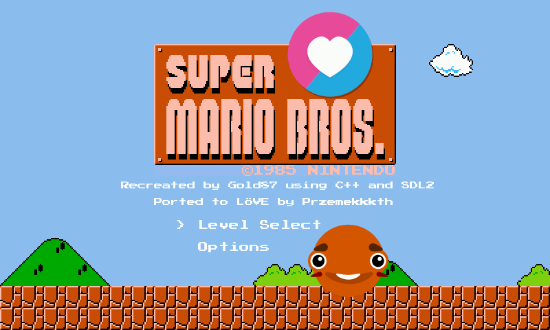

# LÖVE Super Mario Bros
**Love Super Mario Bros** is a game that uses the LÖVE framework to recreate the original, highly popular game [Super Mario Bros](https://en.wikipedia.org/wiki/Super_Mario_Bros.). This project is largely based on Gold87's [repository](https://github.com/Gold872/Super-Mario-Bros) and serves as a port written in Lua language.

## Screenshots

## Controls
| Key    | Action |
| -------- | ------- |
| a, left arrow  | left    |
| d, right arrow | right     |
| space    | jump    |
| s, down arrow    | duck    |
| sprint    | left shift    |
| q    | fireball    |
| m    | mute/unmute    |
| escape    | go back    |

## Addons
* Mario in SDL - Gold87's [repository](https://github.com/Gold872/Super-Mario-Bros)
* [LÖVE](https://love2d.org) framework official website
* [ESC library](https://github.com/Keyslam-Group/Concord)
* [JSON library](https://github.com/rxi/json.lua)
* [OOO library](https://github.com/rxi/classic)
* [Input library](https://github.com/a327ex/boipushy)
* [Gameplay](https://youtu.be/0Z8td5VgF90)
